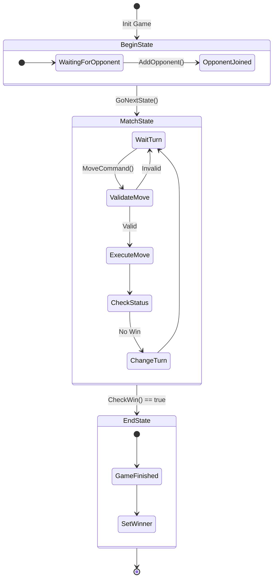
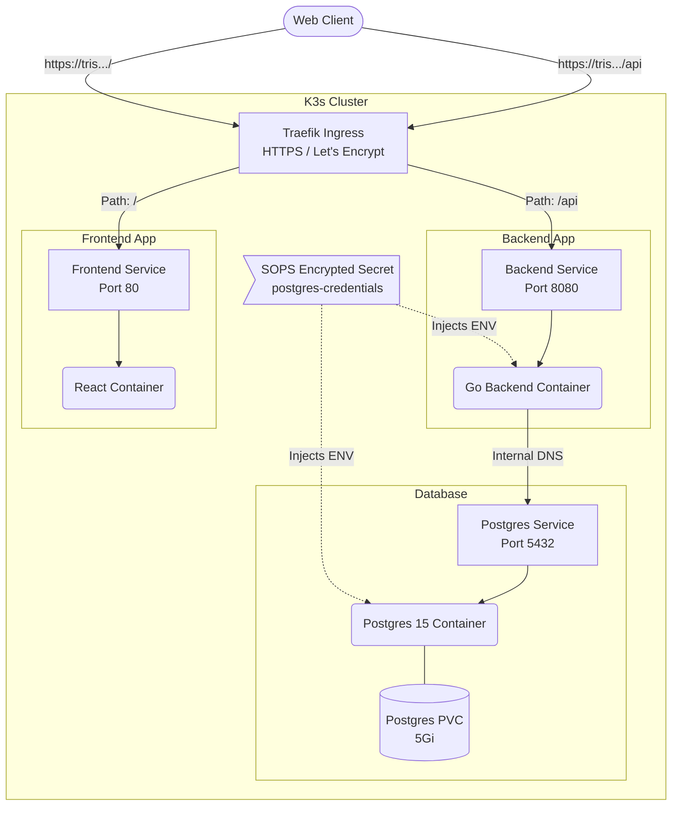
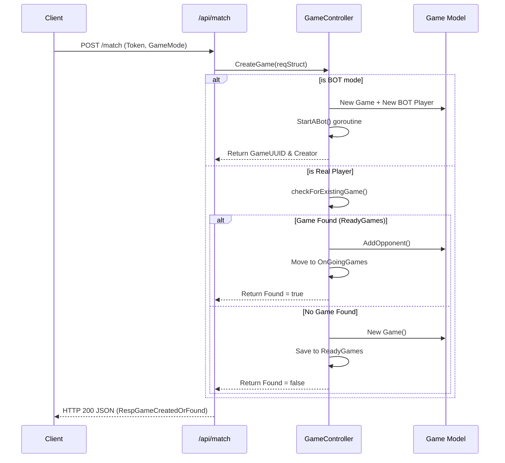

# Tris Inception - Architecture & Deployment

This document provides a comprehensive overview of the architecture, game engine logic, and deployment infrastructure for the Tris Inception project.

---

## 1. System Architecture

The project follows a decoupled architecture, separating the client-side presentation from the server-side game logic and persistence layer.

### Core Components
* **Frontend (React/Vite):** A lightweight client that handles user interactions and renders the game board. [cite_start]It communicates with the backend via REST API polling[cite: 13].
* **Backend (Go):** The core engine of the application. [cite_start]It exposes a RESTful API using the Gin framework [cite: 11, 12] [cite_start]and manages game state, user authentication, and matchmaking[cite: 13, 14].
* [cite_start]**Database (PostgreSQL):** A relational database used for persistent storage of user accounts (with bcrypt hashed passwords) [cite: 36, 37] and future match history.

### Game Engine Logic (State Pattern)
The Ultimate Tic-Tac-Toe rules are strictly enforced server-side to prevent client manipulation. [cite_start]The engine implements the **State Design Pattern** [cite: 82] to manage the flow of a match:
1.  [cite_start]**`BeginState`**: Initializes the board and waits for an opponent[cite: 79, 80].
2.  [cite_start]**`MatchState`**: Handles the active gameplay, validates moves [cite: 84][cite_start], executes them [cite: 84, 85][cite_start], and checks for win conditions[cite: 85].
3.  [cite_start]**`EndState`**: Locks the game once a winner is declared or a draw occurs[cite: 80, 81].



---

## 2. Infrastructure & Deployment (k3s GitOps)

The application is fully containerized and runs on a self-managed **Kubernetes (k3s)** cluster deployed on a remote VPS.

### Traffic Routing & Ingress

External traffic is managed by **Traefik**, which acts as the Ingress controller.

* 
**TLS/HTTPS:** Automated certificate provisioning is handled by `cert-manager` using a Let's Encrypt `ClusterIssuer`.


* 
**Path-Based Routing:** * Requests to `tris.lorenzodortona.com/api` are routed to the Go backend service on port 8080.


* All other requests to the root `/` are routed to the React frontend service on port 80.




### Data Persistence

The PostgreSQL database utilizes a `PersistentVolumeClaim` (PVC) requesting 5Gi of storage. This volume is mounted to `/var/lib/postgresql/data` inside the database container to ensure data survives pod restarts.

### Secrets Management (Mozilla SOPS)

To maintain a public Git repository without compromising security, secrets are managed using **SOPS** and **Age**.

* Any file matching `k3s/secrets/.*\.yaml$` is automatically encrypted.


* The `encrypted_regex: '^(data|stringData)$'` rule ensures that only the sensitive values are encrypted, leaving Kubernetes metadata readable.


* Decrypted secrets are injected directly into the `postgres` and `go-backend` pods as environment variables (`POSTGRES_USER`, `POSTGRES_PASSWORD`, etc.) during deployment.


---

## 3. Matchmaking API Flow

The backend handles matchmaking for both online players and local bot games through the `/api/match` endpoint.



```

